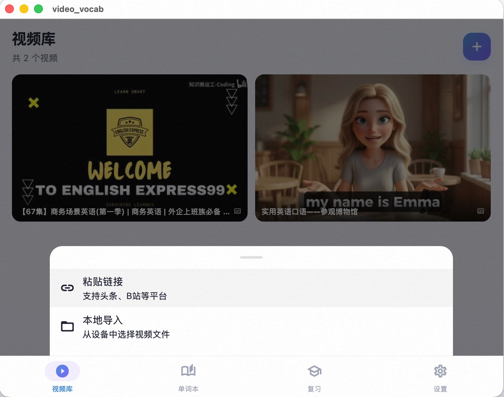
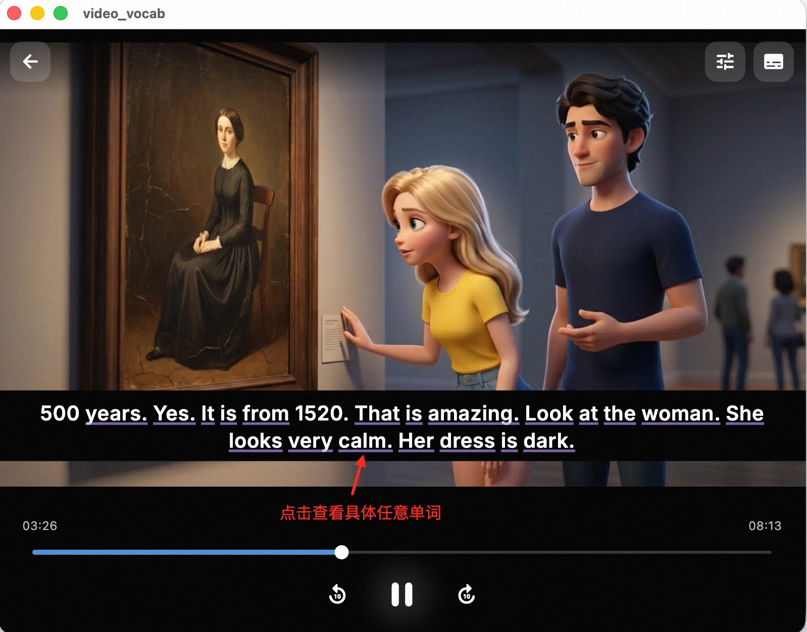
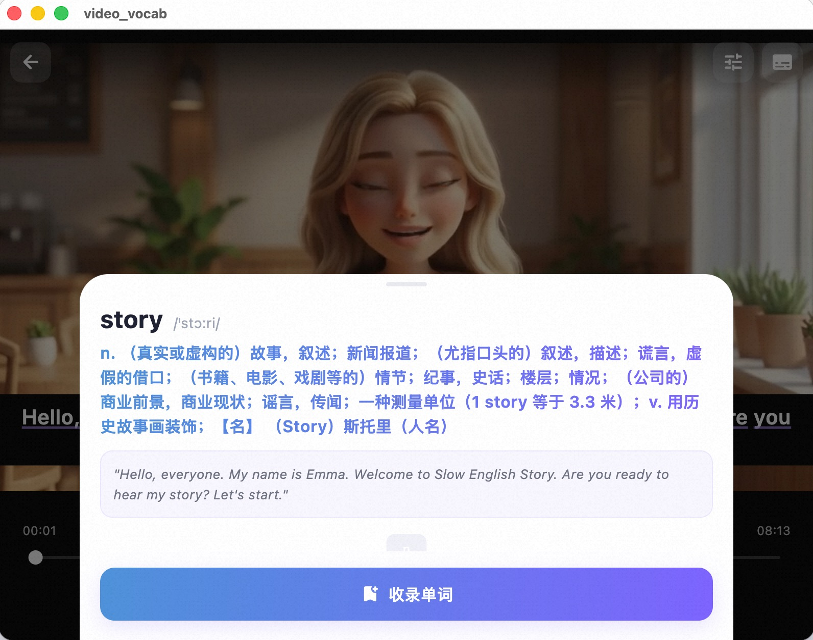
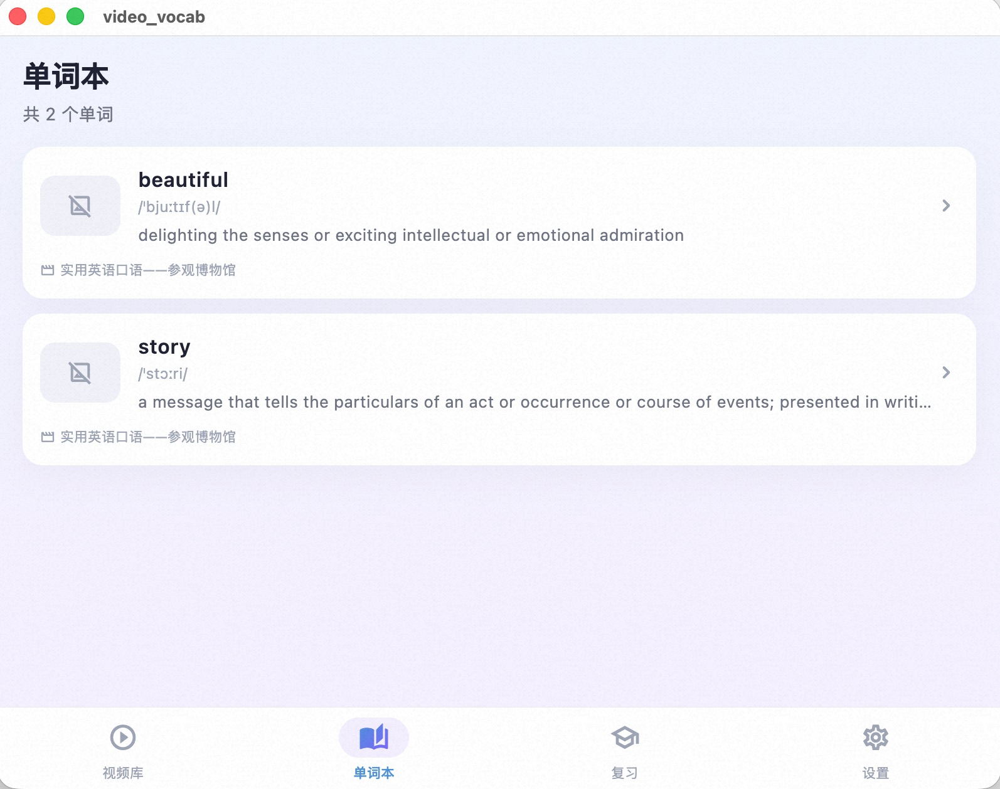
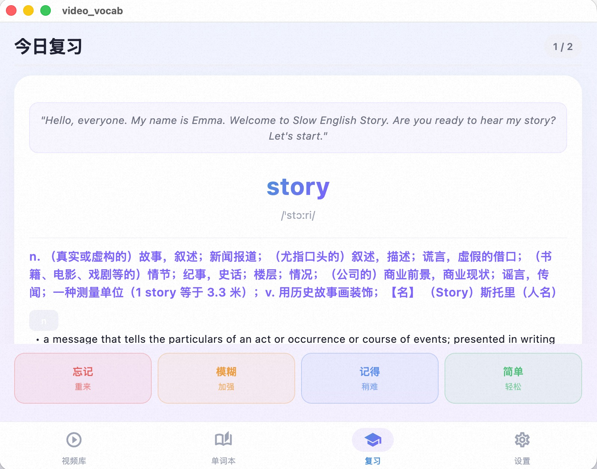

# Video Vocab - 看视频学英语

> 把任何英语视频变成你的单词课堂

还在用枯燥的单词表背单词？**Video Vocab** 让你在看喜欢的英语视频时自然积累词汇——遇到不认识的单词，点一下就能查词、保存，系统会根据记忆曲线帮你安排复习。

## 它能做什么？

### 1. 导入你喜欢的英语视频

粘贴 B站、头条、抖音的分享链接，自动下载视频并生成英文字幕。也可以直接导入本地视频文件。



### 2. 看视频，点字幕学单词

视频播放时，底部显示英文字幕。看到不认识的单词？直接点击它，立刻弹出释义和音标，一秒查词。



### 3. 一键保存到生词本

查到的单词可以一键保存。系统自动帮你记录视频上下文、出现的时间点和画面截图，方便日后回忆。





### 4. 科学复习，记住每个单词

基于间隔重复算法（SM-2），系统每天推送该复习的单词。记得牢的少复习，记不住的多复习，高效不浪费时间。



## 核心亮点

| 功能 | 说明 |
|------|------|
| 智能字幕生成 | 基于 Whisper AI 语音识别，无需手动找字幕 |
| 点词即查 | 点击字幕任意单词，即时显示释义 |
| 上下文记忆 | 保存单词时自动关联视频场景，记忆更深 |
| 间隔复习 | SM-2 算法科学安排复习时间 |
| 多平台支持 | Android / iOS / macOS 均可使用 |
| 字幕可拖动 | 拖动字幕条遮挡视频原始字幕 |
| 支持多来源 | B站、头条、抖音、西瓜视频、本地文件 |

## 下载安装

| 平台 | 下载 |
|------|------|
| Android | [APK 下载](https://github.com/liudong02/vedio_vocap_app/releases/latest/download/VideoVocab-android.apk) |
| iOS | [App 下载](https://github.com/liudong02/vedio_vocap_app/releases/latest/download/VideoVocab-iOS.zip) |
| macOS | [App 下载](https://github.com/liudong02/vedio_vocap_app/releases/latest/download/VideoVocab-macOS.zip) |
| Windows | [App 下载](https://github.com/liudong02/vedio_vocap_app/releases/latest/download/VideoVocab-Windows.zip) |

## 使用流程

```
粘贴视频链接 → 自动下载+生成字幕 → 看视频点单词 → 保存到生词本 → 每日复习
```

## 反馈与联系

有建议或问题？打开 App → 设置 → 反馈与建议，扫码加微信联系我。

---

## 开发者信息

以下内容面向开发者。

### 环境要求

- Flutter SDK >= 3.4.0
- Dart SDK >= 3.4.0
- Xcode（macOS/iOS 构建）
- Android Studio（Android 构建）

### 安装与运行

```bash
git clone <repo-url>
cd vedio_vocap_app

flutter pub get
dart run build_runner build   # 生成数据库代码

flutter run -d macos          # macOS
flutter run                   # 连接的设备
```

### 打包发布

```bash
flutter build apk --release       # Android APK
flutter build macos --release     # macOS App
flutter build ios --release       # iOS（需 Xcode 签名）
```

### 技术架构

```
lib/
├── core/              # 路由、主题、工具（SM-2、SRT 解析）
├── data/              # Drift 数据库、模型、仓储
├── services/          # 播放器、词典、B站/头条解析、Whisper、升级
└── presentation/      # UI（首页、播放器、生词本、复习、设置）
```

### 技术栈

| 类别 | 方案 |
|------|------|
| 状态管理 | Riverpod |
| 路由 | GoRouter |
| 视频播放 | media_kit |
| 数据库 | Drift (SQLite) |
| 语音识别 | whisper_flutter_new (移动端) / whisper CLI (桌面端) |
| 字体 | Inter SemiBold |

### 开发备注

- 修改数据库表后执行 `dart run build_runner build`
- 需递增 `schemaVersion` 并添加迁移逻辑
- UI 语言为简体中文

## License

Private project. All rights reserved.
